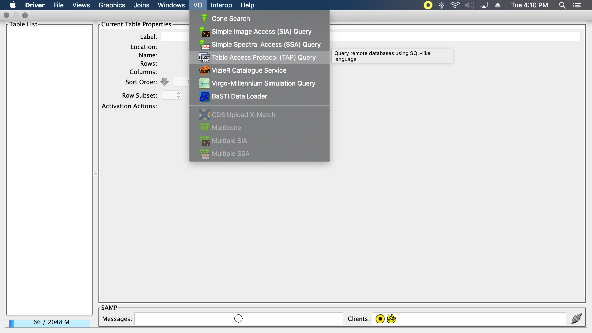
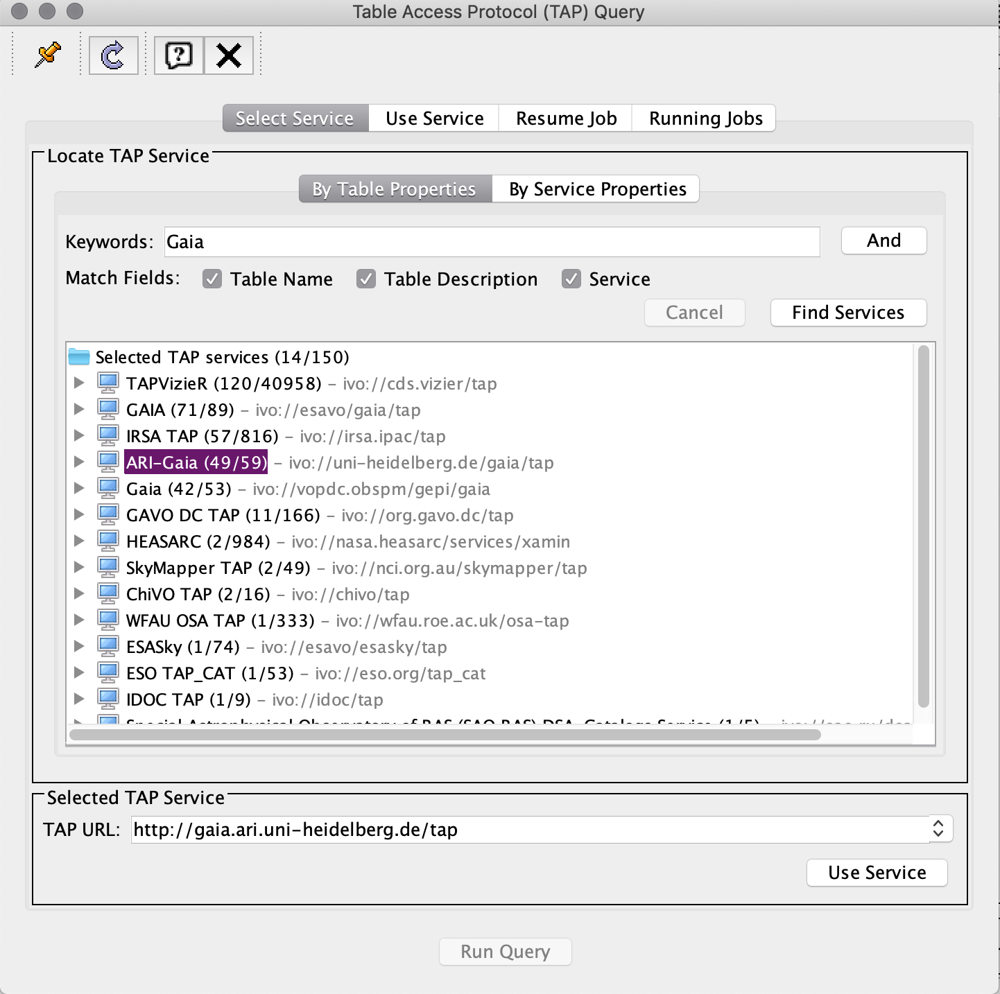
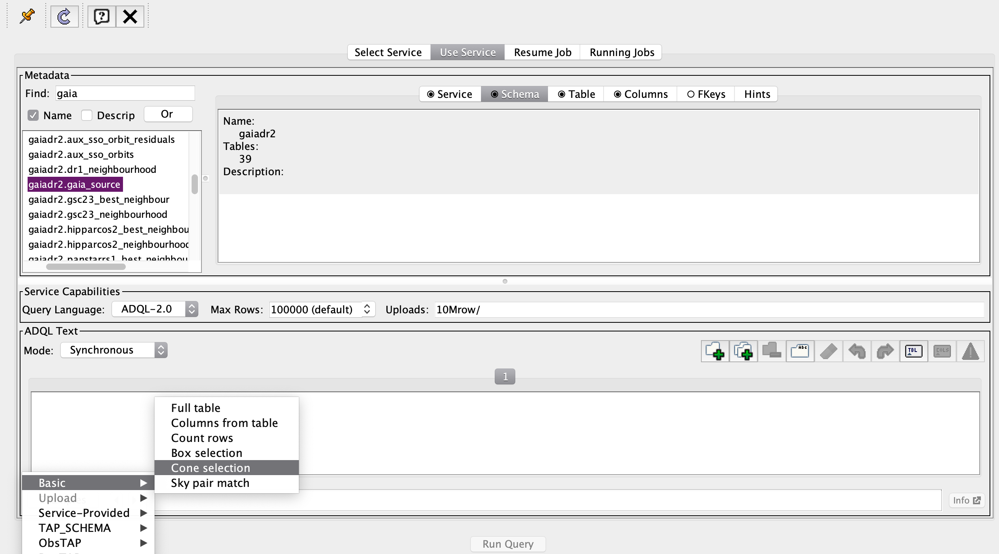
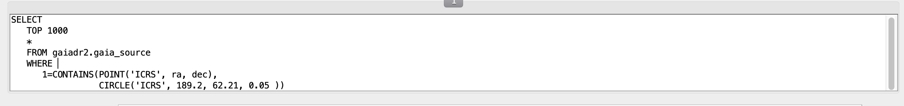

# 							Selecting Data

## 1. Go to VO > Table Access Protocol (TAP) Query

## 

## 2. Search for Gaia Data. Select ARI-Gaia (48/59), use whichever .gaia_source you need.

## 3. Keep Mode on Synchronous (unless it yells at you, then use asynchronous). Go to Examples > Basic > Cone Selection.

## 4. This is the "code" that selects data. TOP ___ designates max number of rows used, Circle() method takes parameters 'ICRS', ra, dec, angle around those coordinates. This will now generate a table with stars that fit those parameters.

 